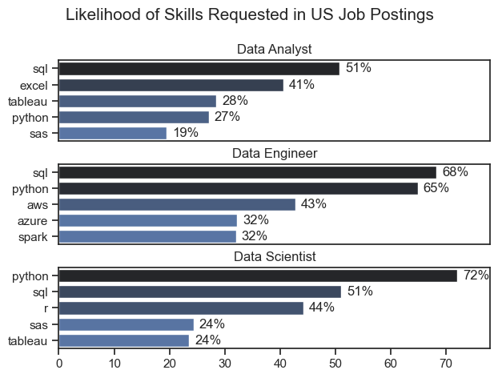
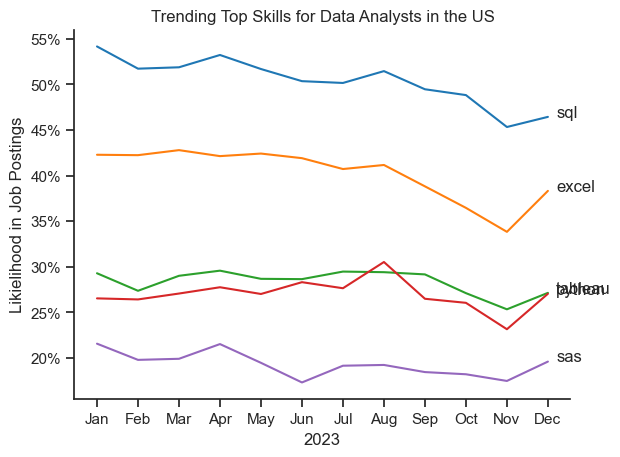
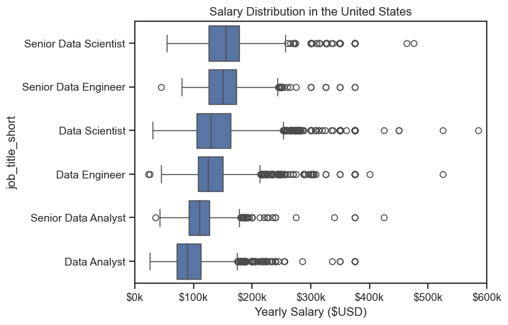
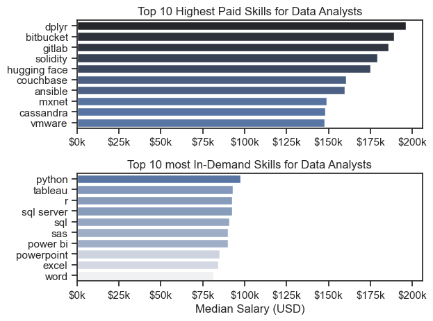
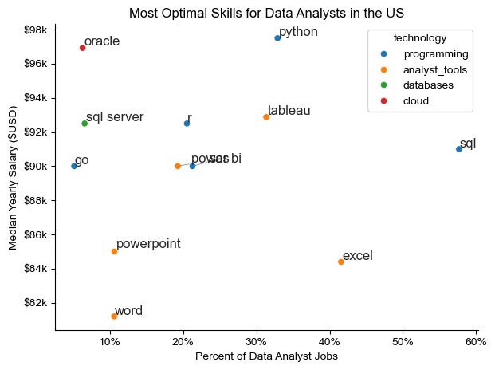

# Data Job Market Analysis: Data Analyst Focus

## Overview
Welcome to my analysis of the data job market, focusing specifically on Data Analyst roles. This project was born out of a desire to navigate and understand the shifting landscape of employment opportunities more effectively. By diving into the data, this project uncovers the top-paying and most in-demand skills required to secure optimal positions in data analytics.

The dataset is sourced from Luke Barousse's Python Course, which provides a rich foundation of information detailing job titles, salaries, locations, and essential skills. Using a series of target-driven Python scripts, I explore core industry questions regarding skill demand, salary trends, and the high-value intersection of the two.

## The Questions
This project aims to answer the following key questions:
1. What are the skills most in demand for the top 3 most popular data roles?
2. How are in-demand skills trending over time for Data Analysts?
3. How well do jobs and specific skills pay for Data Analysts?
4. What are the optimal skills for data analysts to learn? (High Demand **AND** High Paying)

---

## Tools I Used
To conduct this deep dive into the data analyst job market, I harnessed the power of several industry-standard tools:

-   **Python:** The backbone of the analysis, utilized for data manipulation and extracting critical insights. 
    -   *Pandas Library:* Used to clean, filter, and aggregate the raw data.
    -   *Matplotlib Library:* Used for foundational data visualizations.
    -   *Seaborn Library:* Utilized to build advanced, polished statistical visuals.
-    **Jupyter Notebooks:** The interactive environment used to execute Python scripts seamlessly alongside step-by-step documentation and analysis notes.
-   **Visual Studio Code:** My primary integrated development environment (IDE) for executing and managing scripts.
-   **Git & GitHub:** Crucial for version control, project tracking, and sharing code and findings with the broader community.

---

## Data Preparation and Cleanup
This section outlines the steps taken to prepare the data for analysis, ensuring accuracy and usability.

### Import & Clean Up Data
The process started by importing the necessary libraries and loading the raw dataset. Initial data cleaning tasks were executed to ensure data quality, which included handling structural anomalies, filtering out irrelevant roles, parsing nested skill strings into usable formats, and managing missing values.

---

## The Analysis

### 1. What are the most demanded skills for the top 3 most popular data roles?
To find the most demanded skills, I filtered the dataset by the top 3 most popular job titles and identified the top 5 skills associated with each. This comparison highlights which skills carry the most weight depending on the specific career track targeted.


#### Visualize Data
```python
fig, ax = plt.subplots(len(job_titles), 1, figsize=(10, 8))

for i, job_title in enumerate(job_titles):
    df_plot = df_skills_perc[df_skills_perc['job_title_short'] == job_title].head(5)
    sns.barplot(data=df_plot, x='skills_percent', y='job_skills', ax=ax[i], hue='skill_count', palette='dark:b_r')
    ax[i].set_title(f"Top Skills for {job_title}")
    ax[i].set_xlabel("Percentage of Job Postings")
    ax[i].set_ylabel("")

plt.tight_layout()
plt.show()

```
#### Results




#### Insights
 * **Python** is an incredibly versatile skill. It is highly demanded across all three roles, but dominates most prominently for Data Scientists (72%) and Data Engineers (65%).
 * **SQL** is the most critical baseline tool. It is requested in over half of the job postings for both Data Analysts and Data Scientists. For Data Engineers, Python takes the top spot, appearing in 68% of postings.
 * **Specialization vs. Generalization:** Data Engineers require highly specialized infrastructure skills (AWS, Azure, Spark), whereas Data Analysts are expected to be proficient in broader data management and business intelligence tools (Excel, Tableau).

### 2. How are in-demand skills trending for Data Analysis?
#### Visualize Data
```python
plt.figure(figsize=(10, 6))
sns.lineplot(data=df_plot, dashes=False, palette='tab10')

from matplotlib.ticker import PercentFormatter
ax = plt.gca()
ax.yaxis.set_major_formatter(PercentFormatter(decimals=0))

plt.title('Trending Top Skills for Data Analysts in the US')
plt.xlabel('2023 Months')
plt.ylabel('Percentage of Job Postings')
plt.show()

```
#### Results



*Bar graph visualizing the trending top skills for data analysts in the US in 2023.*

#### Insights
 * **SQL** remains the most consistently demanded skill across the year, maintaining its dominant position despite subtle seasonal fluctuations.
 * **Excel** experienced a notable increase in demand starting around September, temporarily shifting above other visual tools.
 * **Tableau and Python** show highly stable, parallel demand throughout the year, cementing themselves as non-negotiable core skills for modern data analysts.
 * **Power BI** displays a steady, gradual upward trajectory toward the end of the year, pointing toward growing corporate adoption.


### 3. How well do jobs and skills pay for Data Analysts?

#### Salary Analysis for Data Roles in the US
```python
plt.figure(figsize=(10, 6))
sns.boxplot(data=df_US_top6, x='salary_year_avg', y='job_title_short', order=job_order)
sns.set_theme(style='ticks')

plt.title('Salary Distribution in the United States')
plt.xlabel('Yearly Salary ($USD)')
plt.ylabel('')

ax = plt.gca()
ax.xaxis.set_major_formatter(plt.FuncFormatter(lambda x, pos: f'${int(x/1000)}k'))
plt.xlim(0, 600000)
plt.show()

```
#### Results




*Box plot visualizing the salary distributions for the top 6 data job titles.*

#### Insights
 * **Role-Based Disparity:** Significant variations in salary ranges exist across roles. Senior Data Scientist positions command the highest ceiling, with upper outliers reaching up to $600k.
 * **High-End Outliers:** Senior Data Engineer and Senior Data Scientist roles show a dense concentration of high-earning outliers, suggesting that specialized expertise or unique industry placements yield massive financial upsides.
 * **Predictability:** Entry-to-mid level Data Analyst roles demonstrate tighter consistency in salary with fewer radical outliers, representing a more predictable compensation floor.


#### Highest Paid vs. Most Demanded Skills for Data Analysts
```python
fig, ax = plt.subplots(2, 1, figsize=(10, 10))

# Top 10 Highest Paid Skills for Data Analysts
sns.barplot(data=df_DA_top_pay, x='median', y=df_DA_top_pay.index, ax=ax[0], hue='median', palette='dark:b_r', legend=False)
ax[0].set_title('Top 10 Highest Paid Skills for Data Analysts')
ax[0].set_xlabel('Median Salary ($USD)')

# Top 10 Most In-Demand Skills for Data Analysts
sns.barplot(data=df_DA_skills, x='median', y=df_DA_skills.index, ax=ax[1], hue='median', palette='light:b', legend=False)
ax[1].set_title('Top 10 Most In-Demand Skills for Data Analysts')
ax[1].set_xlabel('Median Salary ($USD)')

plt.tight_layout()
plt.show()

```
#### Results



*Two separate bar graphs visualizing the highest paid skills and most in-demand skills for data analysts in the US.*

#### Insights
 * **The Niche Premium:** The top graph confirms that highly specialized engineering skills (like dplyr, Bitbucket, and GitLab) are tied to the highest median salaries, often nearing $200k. This proves that niche engineering fluency dramatically spikes earning capacity.
 * **The Employability Baseline:** The bottom graph reinforces that foundational skills like Excel, PowerPoint, and SQL are ubiquitous in listings. While they don't command top-tier niche salaries, they are absolute prerequisites for general market employability.
 * **Strategic Takeaway:** A clear distinction exists between high-paying skills and highly demanded skills. To build an optimal career, an analyst should pair highly marketable foundational skills with a couple of high-paying technical specialties.

### 4. What are the most optimal skills to learn for Data Analysts?
#### Visualize Data
```python
from adjustText import adjust_text
import matplotlib.pyplot as plt

plt.figure(figsize=(10, 8))
plt.scatter(df_DA_skills_high_demand['skill_percent'], df_DA_skills_high_demand['median_salary'])

# Dynamic labeling implementation text using adjustText
texts = [plt.text(row['skill_percent'], row['median_salary'], skill) 
         for skill, row in df_DA_skills_high_demand.iterrows()]
adjust_text(texts, arrowprops=dict(arrowstyle="->", color='r', lw=0.5))

plt.title('Most Optimal Skills for Data Analysts in the US (High Demand & High Pay)')
plt.xlabel('Percent of Job Postings (%)')
plt.ylabel('Median Salary ($USD)')
plt.show()

```
#### Results



*A scatter plot visualizing the most optimal skills (high paying & high demand) for data analysts in the US.*

#### Insights
 * **Programming Payoffs:** Pure programming tools (typically clustered in blue) consistently command a higher tier of baseline salary, indicating that writing clean code remains a premium asset in analytics.
 * **BI Tool Value:** Analytics platforms (like Tableau and Power BI) successfully occupy the "sweet spot"—showing robust presence in job postings alongside highly competitive mid-to-high level salary figures.
 * **Database Infrastructure:** Database-specific tools like Oracle and SQL Server command excellent salary responses, proving that enterprise-level data architecture management remains heavily valued.


## General Insights

This project yielded several fundamental takeaways for navigating the data ecosystem:
 * **Skill Demand & Salary Correlation:** Advanced technical skills and specialized framework competencies directly drive higher market valuation.
 * **Market Dynamism:** The continuous fluctuation of tool popularity underscores that the data market is highly agile. Continually monitoring these trends is mandatory for professional longevity.
 * **Strategic Upskilling:** Mapping skills by both demand and financial payout provides an objective framework for professionals to direct their learning time efficiently.


## Challenges I Faced

This project was not without its challenges, but it provided excellent learning opportunities:
 * **Data Inconsistencies:** Handling missing or mismatched data entries required careful evaluation and thorough data cleaning/preprocessing to prevent skewed metrics and protect analysis integrity.
 * **Complex Data Visualization:** Mapping multi-dimensional data (such as intersecting job titles, skills, popularity ratios, and salary distributions) required strategic design choices to ensure data remained visually clear and impactful.
 * **Balancing Breadth and Depth:** Determining how deep to query specific sub-skills without losing sight of macro-market patterns required constant adjustments to maintain a balanced, comprehensive perspective.


## Conclusion

This exploration into the data analyst job market provides actionable guidance for anyone looking to build or advance a career in data analytics. As technologies and business preferences evolve, continuous empirical analysis will remain necessary to stay competitive. This project establishes a reliable foundation for future research, underscoring that adaptability and continuous upskilling are the ultimate tools for success in the data field.
```

```